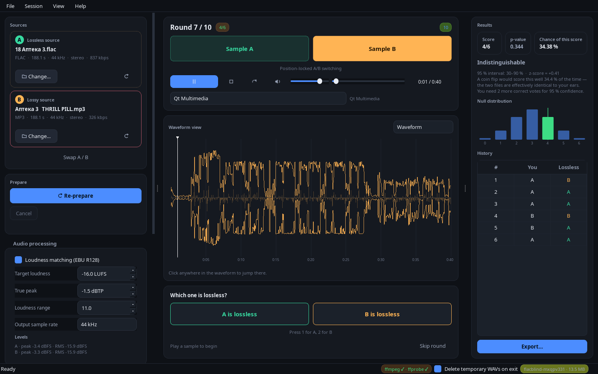

# flacblind

A **blind ABX listening test** for lossless vs. lossy audio, now with a modern
PyQt6 desktop UI (PySide6 also supported).

Drop in the FLAC and the MP3 of the same track, let flacblind loudness-match and
trim them, then find out — with actual statistics, not a gut feeling — whether
you can hear the difference.



---

## Why the old CLI was not enough

The original tool was a `termios`/`paplay` script with ten hard-coded rounds and
a "8/10 — excellent ears!" verdict. This rewrite keeps the science and fixes the
parts that made it unusable:

| Problem in v1 | v2 |
| --- | --- |
| `paplay`/`aplay` only, POSIX terminals only | Three playback backends with an automatic fallback chain, cross-platform |
| UI blocks while ffmpeg converts | `QThread` workers + a real progress bar; the window never freezes |
| One-pass `loudnorm` — the two files can end up at different levels | **Two-pass** EBU R128 normalisation, so level can never be mistaken for quality |
| 10 rounds, whole file only | 5 / 10 / 20 / endless rounds, custom segment with a length cap |
| "Final Score: 8/10" | Exact binomial p-value, Wilson interval, null-distribution plot, verdict text |
| One WAV per file, no seeking | Waveform timeline you can click, plus **position-locked A/B switching** |
| `shutil.rmtree` in a `finally` (leaks on crash) | Registered temp workspaces; leftovers from a crashed run are swept on the next start |
| No drag & drop, no i18n | Drag & drop anywhere in the window, English ⇄ Russian at runtime |

---

## Requirements

* **Python 3.10+**
* **ffmpeg** (with `ffprobe`) — for conversion and loudness measurement
* **PyQt6** *or* **PySide6** 6.5+
* optional: `numpy` (faster waveform analysis), `sounddevice` (sample-accurate playback)

```bash
# Debian / Ubuntu
sudo apt install ffmpeg python3-pyqt6
# Arch Linux
sudo pacman -S ffmpeg python-pyqt6
# macOS
brew install ffmpeg && pip install PyQt6
# Windows
winget install Gyan.FFmpeg && pip install PyQt6
```

Optional extras:

```bash
pip install numpy sounddevice   # sample-accurate switching + fast waveforms
pip install PySide6             # if you prefer PySide6 over PyQt6
```

The app finds ffmpeg on your `PATH`. If it is missing, the UI says so and
explains how to install it instead of crashing.

---

## Running

```bash
python3 flacblind.py            # from a checkout
python3 -m flacblind            # same thing, as a module
flacblind                       # after `pip install .`

python3 flacblind.py --check    # print ffmpeg/backend availability and exit
python3 flacblind.py --language ru
FLACBLIND_QT_API=pyside6 python3 flacblind.py    # force the PySide6 binding
```

> The v1 command line (`--mp3path … --flacpath …`) is gone; the two paths are
> now chosen in the window, by drag & drop or with the *File → Open* dialog.

---

## Using it

1. **Pick two files.** Drag a lossless file (FLAC/WAV/AIFF/ALAC) and a lossy one
   (MP3/AAC/Ogg/Opus) onto the window — the first drop fills the *Lossless*
   slot, the second the *Lossy* slot, and after that files are routed by
   extension. Double-click a card to browse, or use *File → Open*.
2. **Choose what to compare.** By default the whole track is used. Switch to a
   custom segment (start + length) to test just the busy 30 seconds — much
   easier to judge than an intro.
3. **Prepare.** ffprobe/ffmpeg converts both files to 44.1 kHz 16-bit WAV with a
   **two-pass** `loudnorm` (measure, then apply the measured values), so both land
   on the same integrated loudness. Both are then rendered with one shared `-t`
   and cross-correlated against each other, so they start on the same sample —
   an MP3 otherwise carries ~800 samples of encoder padding at the tail, and a
   mismatched start would make the A/B comparison unfair. Progress is reported
   live; *Cancel* kills ffmpeg mid-flight.
4. **Listen.** `A` plays sample A, `B` plays sample B, and switching **keeps the
   playhead exactly where it was** — you hear the same second of the song on
   both sides. The waveform is clickable: jump anywhere with the mouse.
5. **Vote.** Press `1` if A is the lossless file, `2` if B is. The answer is
   revealed (turn this off for a fully blind run) and the statistics update
   immediately.
6. **Read the verdict.** When the session ends you get the exact one-sided
   binomial p-value, the probability of scoring this well by luck, a 95 %
   Wilson interval, the null distribution with your score marked, and the round
   history. *Export* writes the whole thing as JSON or CSV.

### Keyboard shortcuts

| Key | Action |
| --- | --- |
| `Space` | Play / pause the active sample |
| `A` / `B` | Play sample A / sample B (position preserved) |
| `1` / `2` | Vote: A / B is the lossless file |
| `←` / `→` | Seek ∓5 s (`Shift` for ∓15 s) |
| `Esc` | Pause |
| `N` | Next round |
| `M` | Mute / unmute |
| `Ctrl+E` | Export results |
| `Ctrl+N` | New session |
| `F1` | Shortcut help |

Shortcuts are suppressed while a text or number field has focus, so typing a
seed value never casts a vote.

---

## Playback backends

Chosen automatically, or forced in the *Playback* selector:

1. **sounddevice** *(optional)* — both prepared WAVs are decoded into memory and
   the A/B switch is an atomic pointer swap in the audio callback: truly
   sample-accurate, zero gap. Needs `pip install sounddevice`.
2. **Qt Multimedia** — two pre-loaded `QMediaPlayer`s. No extra dependencies,
   works everywhere; switching costs one device-buffer latency (~20–40 ms).
3. **External player** — `ffplay`, `paplay`, `aplay`, `afplay`, `mpv`, `cvlc`.
   Last resort: no seeking, so the position readout is disabled.

All three share one position cursor, which is what makes the comparison
meaningful: whatever is playing, the other sample resumes at the same
millisecond.

---

## How the statistics work

Every round is a coin flip, so the score alone means nothing. flacblind reports
the exact one-sided binomial tail

```
p = P(X >= correct | n, p = 0.5)
```

which is also the probability of scoring *at least this well by accident*, and
uses the ABX community's 95 % threshold:

| rounds | score needed for p < 0.05 |
| --- | --- |
| 5 | 5/5 |
| 10 | 9/10 |
| 20 | 15/20 |

So 8/10 is reported as *inconclusive* — a coin flipper beats it 5.5 % of the
time — while 10/10 gives p = 0.00098. The verdict text says this in words, and
endless mode keeps re-computing it as you go, including the "you need N more
correct answers" hint.

---

## Project layout

```
flacblind/
├── flacblind.py            # v1 entry point, now launches the GUI
├── flacblind/
│   ├── app.py              # bootstrap: theme, window, event loop, --check
│   ├── core/               # Qt-free, fully unit-tested
│   │   ├── models.py       # immutable data model (PreparedPair, RoundRecord, …)
│   │   ├── stats.py        # exact binomial p-value, Wilson interval, verdicts
│   │   ├── ffmpeg.py       # command builders, progress parsing, log→exception
│   │   ├── prepare.py      # probe → measure → render → align → analyse
│   │   ├── align.py        # cross-correlation alignment of the two renders
│   │   ├── waveform.py     # WAV decoding and min/max/RMS envelopes
│   │   ├── abx.py          # the ABX session state machine
│   │   ├── tempstore.py    # temp workspaces + crash-leftover sweeping
│   │   └── settings.py     # JSON settings
│   └── ui/
│       ├── qtcompat.py     # PyQt6 ⇄ PySide6 shim
│       ├── i18n.py         # English/Russian catalogue + runtime switching
│       ├── theme.py        # dark palette, stylesheet, vector icons
│       ├── workers.py      # QThread workers (ffmpeg never blocks the GUI)
│       ├── player.py       # playback backend chain + shared position cursor
│       ├── waveform_view.py# cached-pixmap waveform with playhead and seeking
│       ├── results_panel.py# score, p-value, null distribution, history
│       ├── session_controller.py  # MVP presenter
│       ├── main_window.py  # the view
│       └── widgets.py      # drop cards, stat tiles, segment editor
├── tests/                  # 240 unittest tests, no third-party deps
└── tools/smoke_test.py     # headless end-to-end GUI run
```

**Design rules**

* `core/` never imports Qt, and `ui/` never talks to widgets from a worker
  thread — the boundary is the `SessionController`'s signal surface.
* Everything slow (ffmpeg, decoding, analysis) runs in a `QThread` and reports
  progress through signals.
* Failures are typed (`DependencyError`, `MediaError`, `UnsupportedAudioError`,
  `PreparationError`, `PlaybackError`, `SessionError`) and each carries a
  remediation hint that the UI shows verbatim.

---

## Tests

```bash
cd tests && python3 run_tests.py            # 240 tests, ~45 s
cd tests && python3 run_tests.py stats -v   # filter by module name
FLACBLIND_QT_API=pyside6 python3 run_tests.py
```

Covers the exact p-values against rational arithmetic, the two-pass loudness
pipeline and the sample alignment against real ffmpeg (including the real
`QMediaPlayer` backend, which is how two removed Qt 6 APIs were caught), the
waveform envelope (numpy path vs. pure-stdlib fallback), the session state
machine and controller lifecycle, temp-file sweeping, settings round-trips, the
translation catalogue (including a check that a language switch translates
*every* visible string), the position-locked A/B switch (with a recording fake
backend, a buffering backend and a backend that never starts) and the window's
state transitions, drag & drop and language switching. Tests that need ffmpeg skip themselves when it is absent; everything
runs under Qt's `offscreen` platform.

An end-to-end GUI smoke test (window → real ffmpeg → playback → 10 rounds →
export → temp cleanup, with a screenshot) lives in `tools/smoke_test.py`:

```bash
python3 tools/smoke_test.py /path/lossless.flac /path/lossy.mp3
```

---

## Notes and limits

* ffmpeg's filter syntax changed in version 9 (`loudnorm:I=-16` →
  `loudnorm=I=-16`). flacblind probes which spelling the installed build
  accepts, so it works on ffmpeg 4 through 9.
* Sample alignment needs `numpy`; without it the shared-length trim still
  applies and any residual difference is reported as a warning.
* Dithering the 16-bit output is **off** by default: it would add noise that is
  not in the source, which would be unfair to the lossless side.
* A duration mismatch between the two files produces a warning — different
  edits or masters make any comparison meaningless.
* The temporary WAVs live in `$TMPDIR/flacblind-*`. Each run registers its
  directory in `temp-workspaces.json`; on the next start, directories whose
  owning process is gone are deleted automatically. Untick *Delete temporary
  WAVs on exit* in the status bar to keep them for inspection.

## License

MIT (see the original repository).
